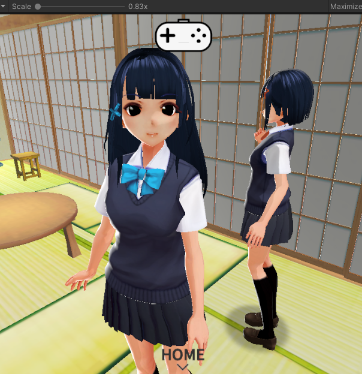

# CodeMaster

代号：主人 

是一款因为疫情宅在家中、利用业余时间开发的免费独立游戏，当前版本理论上支持所有VR眼镜(塞手机的那种便宜眼睛) 和 蓝牙手柄(须支持安卓)

 

最新0.1.16版支持角色卡下载、支持热更新、支持角色配置：可以把小姐姐们分配到不同场所，不同场所有不同的互动。

还有一个隐藏场景，等待主人的发掘。 注：双击角色，即会跟随主人去往不同场景。

游戏当前Demo阶段，借用了D站大神们发布的MMD和XNALara(XPS)资源。因为疫情，无法网购手柄，大家可以自已适配家里的手柄，
然后把自定义按键的截图发给我，我会把它变成默认手柄配置。

当前版本角色动画切换还不流畅，渲染也会有一些裁切问题，后续会陆续完善，如果还有什么建议，各位狗修金SAMA也可以邮箱告诉我~

邮箱 pennathome@hotmail.com
感谢，愿新冠早日终结 ~
